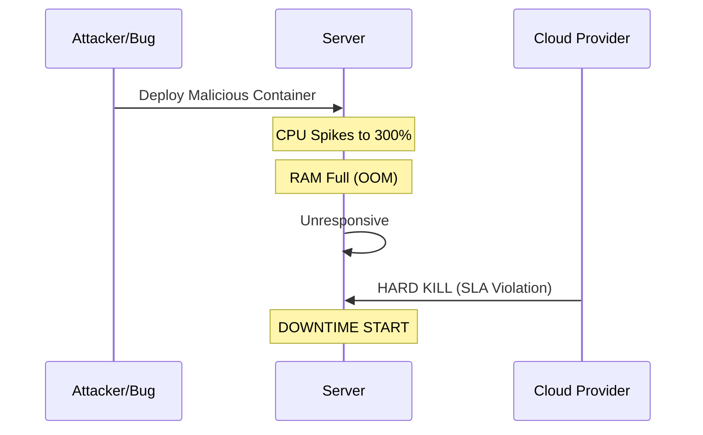
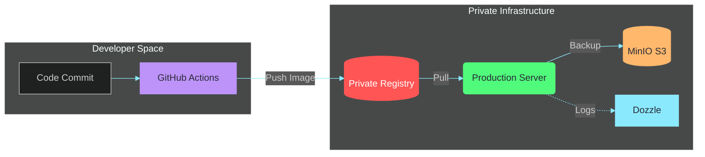

# Resilient Infrastructure & Automated Disaster Recovery

<div class="opacity-80 text-xl">
PBL Semester 4 | 2026
</div>

<div class="mt-4 text-sm opacity-60 italic">
Under the guidance of <strong>Dr. Dibakar Sinha</strong>
</div>

<div class="abs-br m-6 flex gap-2">
  <span class="text-sm opacity-50">Vinayak Tyagi (2427030346)</span>
</div>

<!--
Presenter Notes:
Good morning/afternoon.
I am Vinayak Tyagi.
Today I will present our SDC Automation project.
Our focus was moving from a fragile, manual system to a resilient, automated infrastructure.
-->

---
layout: default
---

# Project Overview

We engineered a **Self-Healing Infrastructure** capable of surviving catastrophic failure.

<div class="grid grid-cols-2 gap-4 mt-10">

<div v-click>

### <carbon:warning-alt class="text-red-400" /> The "Before" State {class="text-red-400"}

- **Fragile:** Manual backups (human error prone).
- **Insecure:** Publicly exposed SSH ports.
- **Unstable:** No resource limits.

</div>

<div v-click>

### <carbon:shield-check class="text-green-400" /> The "After" State {class="text-green-400"}

- **Resilient:** Automated incremental snapshots.
- **Secure:** Zero Trust Mesh Network.
- **Governed:** Kernel-level CPU/RAM Constraints.

</div>

</div>

---

# Team Role & Mandate

As a **DevOps Engineer**, I was responsible for leading the reliability, security, and delivery layers.

<div class="grid grid-cols-2 gap-4 mt-4">

<div v-click class="bg-blue-900/20 p-4 rounded border-b-4 border-blue-500">

#### Automation & CI/CD
We designed GHA pipelines to build and push images to our self-hosted Docker registry.
</div>

<div v-click class="bg-purple-900/20 p-4 rounded border-b-4 border-purple-500">

#### Storage & Backups
We orchestrated the transition to MinIO S3 and designed the `rsync` snapshot logic.
</div>

<div v-click class="bg-green-900/20 p-4 rounded border-b-4 border-green-500">

#### Security
We configured Tailscale ACLs to enforce Zero Trust and patched critical CVEs.
</div>

<div v-click class="bg-orange-900/20 p-4 rounded border-b-4 border-orange-500">

#### Observability
We deployed Dozzle for real-time log streaming and container health monitoring.
</div>

</div>

---

# The Incident: "Black Swan Event"

<div class="grid grid-cols-2 gap-10">

<div>

### The Trigger
A malware container was deployed with unconstrained resources.

### The Impact
- **900% CPU Usage** (Resource Exhaustion)
- **Hard Shutdown** by Cloud Provider
- **58 Minutes** of Downtime

</div>

<div class="text-sm">



</div>
</div>

---

# Architecture & Automated Delivery

We moved from manual deployments to a **GitOps-inspired CI/CD pipeline**.



---

# Zero Trust Networking

We eliminated public attack surfaces using **Tailscale (WireGuard protocol)**.

<div class="grid grid-cols-2 gap-4">

<div>

- **No Public Ports:** SSH port 22 is closed.
- **Identity Based:** Access via SSO.
- **NAT Traversal:** Works behind firewalls.

</div>

<div class="bg-black/40 rounded-xl border border-white/10 overflow-hidden shadow-2xl">
<div class="bg-white/5 px-4 py-2 border-b border-white/10 flex gap-1.5">
  <div class="w-2.5 h-2.5 rounded-full bg-red-500/50"></div>
  <div class="w-2.5 h-2.5 rounded-full bg-yellow-500/50"></div>
  <div class="w-2.5 h-2.5 rounded-full bg-green-500/50"></div>
</div>
<div class="p-4 text-xs font-mono">
<div class="text-green-400 mb-2">$ sudo ufw status</div>
<pre class="text-gray-300">
Status: active

To           Action      From
--           ------      ----
22/tcp       <span class="text-red-400 font-bold">DENY IN</span>     Anywhere
443/tcp      <span class="text-green-400">ALLOW IN</span>    Anywhere
41641/udp    <span class="text-green-400">ALLOW IN</span>    Anywhere
</pre>
<div class="mt-4 text-[10px] opacity-40 italic text-center"># Infrastructure is invisible to external port scanners</div>
</div>
</div>

</div>

---

# Proactive Security Maintenance
### Vulnerability Management (CVE-2025-66478)

We orchestrated an emergency patching cycle for a **Critical RCE** in Next.js.

<div class="grid grid-cols-2 gap-10 mt-4">

<div>

- **The Threat:** Remote Code Execution (CVSS 10.0) via RSC protocol deserialization.
- **Scope:** **7 Projects** identified as vulnerable across the organization.
- **Resolution:** Upgraded Next.js to 16.0.7+ and rotated critical secrets.

</div>

<div class="bg-red-900/20 p-4 rounded border-l-4 border-red-500">

<div class="font-mono text-xs mb-2">SECURITY ADVISORY</div>

"Successfully exploiting this vulnerability allows attackers to execute system commands and access sensitive environment variables."

<div class="mt-2 text-right opacity-50 text-xs">— Next.js Security Team</div>

</div>

</div>

---

# Automated Incremental Backups

We engineered a bash-based snapshot system using `rsync` hard-links.

<div class="grid grid-cols-2 gap-8">

```bash {all|2|6-9}
# The Core Logic
# --link-dest creates hard links to PREVIOUS
# 0% Storage use for unchanged files.

rsync -avz --delete 
  --link-dest=../latest 
  /source/data/ 
  /backups/snapshot-$(date +%F-%H%M)/
```

<div>

### Projected Efficiency

<StorageSavings />

</div>
</div>

---

# Observability: Real-Time Monitoring

We implemented **Dozzle** to provide high-performance, real-time log visibility without the overhead of heavy ELK stacks.

<div class="grid grid-cols-2 gap-10">

<div>

- **Zero Configuration:** Automatically discovers all running containers.
- **Log Streaming:** Real-time visibility into application behavior.
- **Resource Efficient:** Extremely low memory footprint.
- **Security:** Access restricted via Tailscale VPN.

</div>

<div class="bg-black/40 p-2 rounded shadow-2xl border border-white/10">

<div class="text-[10px] text-center mt-2 opacity-50 italic">Dozzle Interface: Static view of container log dashboard</div>
</div>

</div>

---
transition: fade
---

# Governance: Resource Limits
### The Vulnerable Config (Legacy)

```yaml
services:
  student-portal:
    image: sdc/portal:latest
    # No resource constraints
    # One bug can take down the whole host
```

---

# Governance: Resource Limits
### The Resilient Config (Our Implementation)

```yaml {6-11}
services:
  student-portal:
    image: sdc/portal:latest
    deploy:
      resources:
        limits:
          cpus: '0.50'     # HARD CAP: 50% of 1 core
          memory: 512M     # OOM Kill if exceeded
        reservations:
          cpus: '0.10'
          memory: 128M
```

<div class="mt-4 bg-yellow-900/30 p-4 rounded text-sm border-l-4 border-yellow-500">
<strong>Kernel Level:</strong> Uses Linux <code>cgroups</code> to throttle malicious or buggy processes without crashing the OS.
</div>

---

# Storage Modernization (MinIO)

We migrated static assets from Block Storage to **Object Storage**.

<div class="grid grid-cols-2 gap-6 mt-6">

<div>

#### The Problem
- Hard to scale.
- Single Point of Failure.
- Inefficient for active files.

</div>

<div>

#### The MinIO Solution
- **Immutable:** WORM locking.
- **S3 API:** Cloud Native standard.
- **Decoupled:** High availability.

</div>

</div>

---

# Reliability Metrics (ROI)

Quantifying the impact of these engineering changes.

| Metric | Definition | Before | After | Improvement |
| :--- | :--- | :--- | :--- | :--- |
| **RPO** | Recovery Point Objective | 24 Hours | **1 Hour** | **24x Better** |
| **RTO** | Recovery Time Objective | ~4 Hours | **< 5 Mins** | **48x Faster** |
| **Uptime** | Availability | 92% | **99.9%** | **High Availability** |

---

# Future Roadmap

- **<carbon:locked /> Phase 1: Immutable Backups**
  - Enable Object Locking (Governance Mode) on MinIO.
- **<carbon:Flash /> Phase 2: Chaos Engineering**
  - Implement "Chaos Monkey" for auto-restart verification.
- **<carbon:Earth /> Phase 3: Multi-Region Sync**
  - Off-site replication for disaster recovery.
- **<carbon:Security /> Phase 4: Security Guardrails**
  - Automate dependency patching (Renovate/Dependabot) to prevent zero-day exposure.

---
layout: center
class: text-center
---

# Conclusion

Resilience is not a product you buy.
It is an **architectural choice**.

<div class="mt-10 opacity-75">
Thank You
</div>

<div class="mt-4 text-sm font-mono text-pink-500">
github.com/vinayaktyagi10/pbl_project
</div>