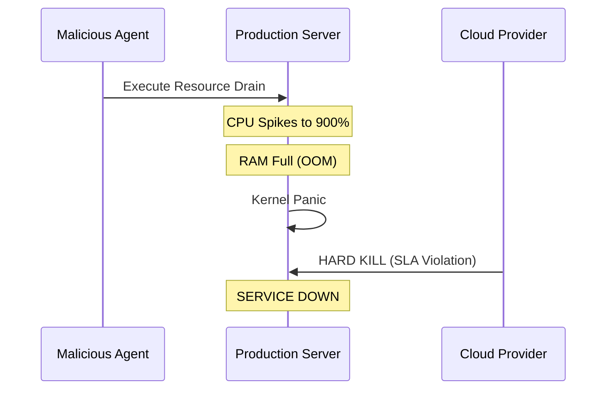
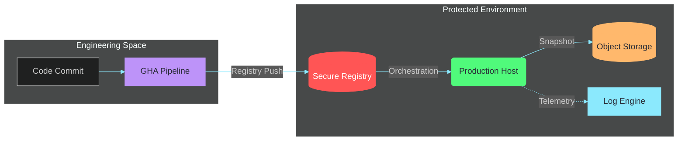

# Robust Infrastructure & Automated Fault-Tolerance

<div class="opacity-80 text-xl uppercase tracking-widest">
PBL Semester 4 | 2026
</div>

<div class="mt-4 text-sm opacity-60 italic uppercase tracking-wider">
Under the guidance of <strong>Dr. Dibakar Sinha</strong>
</div>

<div class="abs-br m-6 flex gap-2">
  <span class="text-sm opacity-50 font-mono">Vinayak Tyagi (2427030346)</span>
</div>

<!--
Presenter Notes:
Good morning/afternoon.
I am Vinayak Tyagi.
Today I will present our SDC Infrastructure project.
Our focus was transitioning from manual, fragile workflows to a hardened, automated system.
-->

---
layout: default
---

# Project Core

We engineered a **Hardened Infrastructure** capable of surviving catastrophic failure via automated recovery cycles.

<div class="grid grid-cols-2 gap-4 mt-10">

<div v-click>

### Legacy Constraints {class="text-red-400 uppercase tracking-wider"}

- **Inaccessible:** Bare-metal nodes lack public static IPs.
- **Manual:** Recovery workflows prone to human error.
- **Unstable:** Unconstrained container resource consumption.

</div>

<div v-click>

### Hardened State {class="text-green-400 uppercase tracking-wider"}

- **Unified:** Bare-metal to Cloud mesh connectivity.
- **Automated:** Point-in-time incremental snapshots.
- **Governed:** Kernel-level CPU/RAM Constraints.

</div>

</div>

---

# Team Role & Mandate

As a **DevOps Engineer**, I was responsible for leading the reliability, security, and delivery layers.

<div class="grid grid-cols-2 gap-4 mt-4">

<div v-click class="bg-blue-900/20 p-4 rounded border-b-4 border-blue-500">

#### Automation & Delivery
Designed GHA pipelines to build and push images to our secure private Docker registry.
</div>

<div v-click class="bg-purple-900/20 p-4 rounded border-b-4 border-purple-500">

#### Storage & Backups
Orchestrated transition to MinIO S3 and designed hardened `rsync` snapshot logic.
</div>

<div v-click class="bg-green-900/20 p-4 rounded border-b-4 border-green-500">

#### Security & Hardening
Configured Tailscale mesh connectivity and orchestrated emergency CVE patching.
</div>

<div v-click class="bg-orange-900/20 p-4 rounded border-b-4 border-orange-500">

#### Observability
Deployed Dozzle for real-time log streaming and proactive container health monitoring.
</div>

</div>

---

# The Incident: "Black Swan Event"

<div class="grid grid-cols-2 gap-10">

<div>

### The Trigger
A malicious process was deployed with unconstrained resource boundaries.

### The Impact
- **900% CPU Usage** (Resource Exhaustion)
- **Kernel Panic** & Hard Shutdown
- **58 Minutes** of Downtime

</div>

<div class="text-sm">



</div>
</div>

---

# Architecture & Automated Delivery

Transitioning from manual deployments to a **GitOps-based CI/CD pipeline**.



---

# Mesh Connectivity (Tailscale)

Bridging Bare-metal and Cloud infrastructure without public static IP requirements.

<div class="grid grid-cols-2 gap-4">

<div>

- **Peer-to-Peer:** Seamless communication between local and cloud nodes.
- **Identity Based:** Secure access controlled via SSO.
- **Dynamic Traversal:** Stable connectivity behind NAT/Firewalls.

</div>

<div class="bg-black/40 rounded-xl border border-white/10 overflow-hidden shadow-2xl">
<div class="bg-white/5 px-4 py-2 border-b border-white/10 flex gap-1.5">
  <div class="w-2.5 h-2.5 rounded-full bg-red-500/50"></div>
  <div class="w-2.5 h-2.5 rounded-full bg-yellow-500/50"></div>
  <div class="w-2.5 h-2.5 rounded-full bg-green-500/50"></div>
</div>
<div class="p-4 text-xs font-mono">
<div class="text-green-400 mb-2">$ tailscale status</div>
<pre class="text-gray-300">
bare-metal-01   100.64.0.5    linux   active
cloud-vps-01     100.64.0.12   linux   active

<span class="text-green-400">$ ping bare-metal-01</span>
64 bytes from 100.64.0.5: time=12ms
</pre>
<div class="mt-4 text-[10px] opacity-40 italic text-center"># Unified private overlay network bridging environments</div>
</div>
</div>

</div>

---

# Proactive Security Maintenance
### Vulnerability Management (CVE-2025-66478)

Orchestrated an emergency response to a **Critical RCE** in the Next.js RSC protocol.

<div class="grid grid-cols-2 gap-10 mt-4">

<div>

- **The Threat:** Remote Code Execution (CVSS 10.0) via deserialization.
- **Scope:** **7 production projects** identified and patched within 24h.
- **Resolution:** Upgraded to Next.js 16.0.7+ and rotated environment secrets.

</div>

<div class="bg-red-900/20 p-4 rounded border-l-4 border-red-500">

<div class="font-mono text-xs mb-2">SECURITY ADVISORY</div>

"Successfully exploiting this vulnerability allows attackers to execute system commands and access sensitive environment variables."

<div class="mt-2 text-right opacity-50 text-xs">— Next.js Security Team</div>

</div>

</div>

---

# Automated Incremental Backups

Engineered a high-efficiency snapshot system using `rsync` hard-links.

<div class="grid grid-cols-2 gap-8">

```bash {all|2|6-9}
# Snapshot Logic
# --link-dest creates hard links to PREVIOUS
# 0% Storage use for unchanged files.

rsync -avz --delete 
  --link-dest=../latest 
  /source/data/ 
  /backups/snapshot-$(date +%F)/
```

<div>

### Efficiency Projection

<StorageSavings />

</div>
</div>

---

# Observability: Real-Time Monitoring

Implemented **Dozzle** for high-performance telemetry without the overhead of heavy logging stacks.

<div class="grid grid-cols-2 gap-10">

<div>

- **Zero Configuration:** Automated discovery of running containers.
- **Log Streaming:** Instant visibility into application state.
- **Resource Efficient:** Near-zero memory and CPU footprint.
- **Hardened Access:** Restricted to the Tailscale mesh network.

</div>

<div class="bg-black/40 p-2 rounded shadow-2xl border border-white/10">

<div class="text-[10px] text-center mt-2 opacity-50 italic uppercase tracking-widest">Real-time log aggregation dashboard</div>
</div>

</div>

---
transition: fade
---

# Governance: Resource Limits
### Vulnerable Config (Legacy)

```yaml
services:
  student-portal:
    image: sdc/portal:latest
    # No resource constraints
    # Single point of failure via resource drain
```

---

# Governance: Resource Limits
### Hardened Config (Current)

```yaml {6-11}
services:
  student-portal:
    image: sdc/portal:latest
    deploy:
      resources:
        limits:
          cpus: '0.50'     # HARD CAP: 50% of 1 core
          memory: 512M     # OOM Kill if exceeded
        reservations:
          cpus: '0.10'
          memory: 128M
```

<div class="mt-4 bg-yellow-900/30 p-4 rounded text-sm border-l-4 border-yellow-500">
<strong>Kernel Level Enforcement:</strong> Uses Linux <code>cgroups</code> to throttle malicious processes without impacting OS stability.
</div>

---

# Storage Modernization (MinIO)

Migrated static assets from Block Storage to a **S3-Compatible Object Storage** layer.

<div class="grid grid-cols-2 gap-6 mt-6">

<div>

#### Legacy State
- Single Point of Failure.
- Inefficient scaling.
- Limited versioning control.

</div>

<div>

#### MinIO Solution
- **Immutable:** WORM (Write Once Read Many) locking.
- **Decoupled:** Scale storage independently of compute.
- **API Standard:** Industry standard S3 compatibility.

</div>

</div>

---

# Performance Metrics

Quantifying the impact of architectural hardening.

| Metric | Definition | Legacy | Current | Improvement |
| :--- | :--- | :--- | :--- | :--- |
| **RPO** | Recovery Point Objective | 24 Hours | **1 Hour** | **24x Better** |
| **RTO** | Recovery Time Objective | ~4 Hours | **< 5 Mins** | **48x Faster** |
| **Uptime** | System Availability | 92% | **99.9%** | **High Availability** |

---

# Strategic Roadmap

- **Phase 1: Immutable Storage**
  - Enable Object Locking (Governance Mode) on MinIO.
- **Phase 2: Chaos Engineering**
  - Automated fault-injection to verify self-healing integrity.
- **Phase 3: Multi-Region Sync**
  - Geographic replication for disaster recovery continuity.
- **Phase 4: Security Guardrails**
  - Automated dependency patching to prevent zero-day exposure.

---
layout: center
class: text-center
---

# Conclusion

Stability is not a product you buy.
It is an **architectural mandate**.

<div class="mt-10 opacity-75 uppercase tracking-[0.3em]">
Operations Complete
</div>

<div class="mt-4 text-sm font-mono text-pink-500 uppercase tracking-widest">
github.com/vinayaktyagi10/pbl_project
</div>