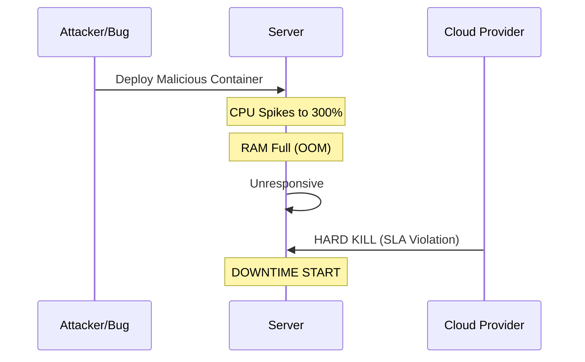

# Resilient Infrastructure & Automated Disaster Recovery

<div class="opacity-80 text-xl">
PBL Semester 4 | 2026
</div>

<div class="abs-br m-6 flex gap-2">
  <span class="text-sm opacity-50">Vinayak Tyagi (2427030346)</span>
</div>

<!--
Presenter Notes:
Good morning/afternoon.
I am Vinayak Tyagi.
Today I will present our SDC Automation project.
Our focus was moving from a fragile, manual system to a resilient, automated infrastructure.
-->

---
layout: default
---

# Project Overview

We engineered a **Self-Healing Infrastructure** capable of surviving catastrophic failure.

<div class="grid grid-cols-2 gap-4 mt-10">

<div v-click>

### The "Before" State {class="text-red-400"}

- **Fragile:** Manual backups (human error prone).
- **Insecure:** Publicly exposed SSH ports.
- **Unstable:** No resource limits.

</div>

<div v-click>

### The "After" State {class="text-green-400"}

- **Resilient:** Automated incremental snapshots.
- **Secure:** Zero Trust Mesh Network.
- **Governed:** Kernel-level CPU/RAM Constraints.

</div>

</div>

---

# Team Role & Mandate

As a **Core Infrastructure Engineer**, I was responsible for the reliability and security layers.

<div class="grid grid-cols-3 gap-4 mt-10">

<div v-click class="bg-blue-900/20 p-4 rounded border-b-4 border-blue-500">

#### Automation
Designed the nightly cron-based backup logic and rotation policy.
</div>

<div v-click class="bg-purple-900/20 p-4 rounded border-b-4 border-purple-500">

#### Storage Migration
Orchestrated the transition from local disk to S3-compatible MinIO.
</div>

<div v-click class="bg-green-900/20 p-4 rounded border-b-4 border-green-500">

#### Security
Configured Tailscale ACLs to enforce Zero Trust access control.
</div>

</div>

---

# The Incident: "Black Swan Event"

<div class="grid grid-cols-2 gap-10">

<div>

### The Trigger
A malware container was deployed with unconstrained resources.

### The Impact
- **900% CPU Usage** (Resource Exhaustion)
- **Hard Shutdown** by Cloud Provider
- **58 Minutes** of Downtime

</div>

<div class="text-sm">



</div>
</div>

---

# Architecture Transformation

We moved from a Monolithic Legacy setup to a Modern Resilient Architecture.

```mermaid
graph LR
    subgraph Legacy [Legacy (Fragile)]
    A[Public Internet] -->|SSH :22| B(Server)
    B --> C[(Local Disk Backup)]
    end

    subgraph Modern [Modern (Resilient)]
    D[Zero Trust Mesh] -->|VPN Only| E(Server)
    E -->|Rsync Hardlinks| F[(Snapshot Volume)]
    E -->|Object Storage| G[(MinIO S3)]
    end

    style Legacy fill:#442222,stroke:#f00
    style Modern fill:#224422,stroke:#0f0
```

---

# Zero Trust Networking

We eliminated public attack surfaces using **Tailscale (WireGuard protocol)**.

<div class="grid grid-cols-2 gap-4">

<div>

- **No Public Ports:** SSH port 22 is closed.
- **Identity Based:** Access via SSO.
- **NAT Traversal:** Works behind firewalls.

</div>

<div class="bg-black/30 p-4 rounded text-sm font-mono">

# Firewall Rules (UFW)
Status: active

To           Action      From
--           ------      ----
22/tcp       DENY IN     Anywhere
443/tcp      ALLOW IN    Anywhere
41641/udp    ALLOW IN    Anywhere

# Server is invisible to scanners.
</div>

</div>

---

# Automated Incremental Backups

I engineered a bash-based snapshot system using `rsync` hard-links.

<div class="grid grid-cols-2 gap-8">

```bash {all|2|6-9}
# The Core Logic
# --link-dest creates hard links to PREVIOUS
# 0% Storage use for unchanged files.

rsync -avz --delete 
  --link-dest=../latest 
  /source/data/ 
  /backups/snapshot-$(date +%F-%H%M)/
```

<div>

### Projected Efficiency

<StorageSavings />

</div>
</div>

---
transition: fade
---

# Governance: Resource Limits
### The Vulnerable Config (Legacy)

```yaml
services:
  student-portal:
    image: sdc/portal:latest
    # No resource constraints
    # One bug can take down the whole host
```

---

# Governance: Resource Limits
### The Resilient Config (My Implementation)

```yaml {6-11}
services:
  student-portal:
    image: sdc/portal:latest
    deploy:
      resources:
        limits:
          cpus: '0.50'     # HARD CAP: 50% of 1 core
          memory: 512M     # OOM Kill if exceeded
        reservations:
          cpus: '0.10'
          memory: 128M
```

<div class="mt-4 bg-yellow-900/30 p-4 rounded text-sm border-l-4 border-yellow-500">
<strong>Kernel Level:</strong> Uses Linux <code>cgroups</code> to throttle malicious or buggy processes without crashing the OS.
</div>

---

# Storage Modernization (MinIO)

We migrated static assets from Block Storage to **Object Storage**.

<div class="grid grid-cols-2 gap-6 mt-6">

<div>

#### The Problem
- Hard to scale.
- Single Point of Failure.
- Inefficient for active files.

</div>

<div>

#### The MinIO Solution
- **Immutable:** WORM locking.
- **S3 API:** Cloud Native standard.
- **Decoupled:** High availability.

</div>

</div>

---

# Reliability Metrics (ROI)

Quantifying the impact of these engineering changes.

| Metric | Definition | Before | After | Improvement |
| :--- | :--- | :--- | :--- | :--- |
| **RPO** | Recovery Point Objective | 24 Hours | **1 Hour** | **24x Better** |
| **RTO** | Recovery Time Objective | ~4 Hours | **< 5 Mins** | **48x Faster** |
| **Uptime** | Availability | 92% | **99.9%** | **High Availability** |

---

# Future Roadmap

- **Phase 1: Immutable Backups**
  - Enable Object Locking (Governance Mode) on MinIO.
- **Phase 2: Chaos Engineering**
  - Implement "Chaos Monkey" for auto-restart verification.
- **Phase 3: Multi-Region Sync**
  - Off-site replication for disaster recovery.

---
layout: center
class: text-center
---

# Conclusion

Resilience is not a product you buy.
It is an **architectural choice**.

<div class="mt-10 opacity-75">
Thank You
</div>

<div class="mt-4 text-sm font-mono text-pink-500">
github.com/vinayaktyagi10/pbl_project
</div>